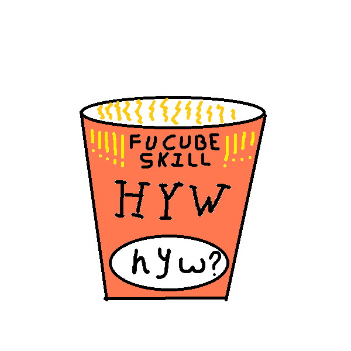

# HYW.skill

[简体中文](README.md) | **English**

<div align="center">
  
  
  
  
  
  
</div>

<div align="center">
  <br/>
  <em>The HYW ramen cup · HYW on the body · a small white "hyw?" oval at the bottom.<br/>
  To a baffling move by the AI, it asks one calm, detached "what does it even mean?".</em>
</div>

<div align="center" style="background-color: #1a1a2e; color: #eaeaea; border-radius: 12px; padding: 24px 16px; border: 1px solid #3a3a5e;">

# ❓ HYW · What does it even mean?

**Make the AI ask "what does it even mean?" to its own most baffling move, then hand the choice back to you.**

</div>

| | |
|---|---|
| 📄 Format | Markdown skill (frontmatter `SKILL.md`) + `skill.json` metadata |
| 🧩 Compat. | Claude Code / Codex / DSH presets / WorkBuddy / any agent that loads Markdown skills |
| 🌏 Language | English (default) · 简体中文 |
| ⚖️ License | MIT |

> ⚠️ **Not the official project of the 「何意味」 internet meme.** HYW · 何意味 is a FuCube-original meme-driven meta-skill. It is **NOT an official project** of the meme, and is **not affiliated with any third party**. 「何意味」 ("what does it even mean", from the Japanese「何の意味」) is a 2025 public internet meme; HYW merely codifies it as an agent self-discipline and **claims no rights over the meme itself**.

---

## One-line pitch

> When an AI/agent itself just made a baffling decision, an over-the-top reply, or something no human would naturally write, **HYW auto-jumps in with a calm, detached "what does it even mean?"** — lays out its motive, self-suspects the suspicious bits, and hands the decision power fully back to you.

It does not decide for you, and it does not stay silent. It is the **meme sibling of NEVERMIND** ("whatever" vs. "is this even reasonable?") — both routes give dignity back to anyone facing absurd reality.

> **👤 If the AI doesn't realize how abstract its own move was** — it won't auto-trigger, or you don't want to wait for it to admit it — **you can interrogate it directly**: send any one trigger word to the agent
>
> ```
> 何意味 · 和依未 · hyw · ? · ？
> ```
>
> It instantly opens with the ironic self-surrender "你说得对，但是……" and runs the three things against its **most recent output / decision**, then hands the choice back to you. Typos (`hys?`), any Chinese homophone whose pinyin is *he-yi-wei*, or even a lone question mark all count.

---

## Three things (every trigger must do all of them)

1. **Explain** — what was this step trying to do? (lay the motive open, no hiding, no post-hoc story)
2. **Self-suspect** — is this over-the-top / logically broken / over-packaged? (call out each suspicious bit, tagged 🔴/🟡/🟢)
3. **Hand back** — give the decision to the human: **I don't decide. Keep / change / revert — your call.** If Camelot.skill is around and code is involved, surface a "⚔️ Holy Sword Verdict" entry to escalate.

Form is flexible. The order and the **must-do-ness** are not.

### Manual invocation always opens with: "你说得对，但是" ("You're right, but...")

When the user summons HYW with a trigger word (何意味 / 和依未 / hyw / ? / ？), the AI must open its reply with this ironic self-surrender:

> 你说得对，但是…… (then proceeds to the three things)

This punctures the AI's classic "you're right, but..." deference script — HYW admits it is *also* playing that script — and only then does the actual self-suspect begin.

### ④ Meta-self-suspect — HYW audits itself

After the first three things, HYW runs **one quick self-check** on its own output (short, non-recursive, three questions only):

- Was my three-things response longer than the original suspicious step?
- Did I sneak any rationalisation into the self-suspect?
- Did I smuggle in a "I suggest you..." into the hand-back?

If any of those fire, mark it, admit "我自己也废话了". **One pass, no recursion** — the goal is to keep HYW itself from becoming the next layer of empty talk.

---

## When to trigger (hard discipline, not a suggestion)

HYW **must** trigger the moment the AI itself shows any of these three signals:

- **Baffling decision** — silently rewriting many files at once, merging unrelated edits, skipping clarification and acting anyway, holding assumptions tight without checking
- **Over-the-top reply** — over-packaging, adjective density spiking, empty filler paragraphs added to "look complete", info-free essayism
- **Unhinged output** — text/code/data no human would write (obvious AI fingerprints, broken context, made-up terminology that *sounds* right but isn't)

Two trigger paths, different opening styles:

- **A · Auto-trigger (the AI itself notices)** — finish the current paragraph normally, then tack on a hesitant "可是，何意味？" at the end → `===== probe start =====` → then run ①Explain / ②Self-suspect / ③Hand back / ④Meta-self-suspect. It does **not** open with "你说得对，但是" (that is B-path manual-invocation only).
- **B · Manual invocation (user summons with a trigger word)** — user says 「何意味 / 和依未 / hyw / ? / ？」 (typos, pinyin he-yi-wei homophones, and bare question-marks all count), the AI opens with the ironic self-surrender "你说得对，但是" ("You're right, but..."), then runs the three things.

Side role (auto-interrogation of input): when the **user's input is itself vague/buzzwordy/empty talk**, the AI may proactively say "何意味？" before producing an answer, as a quiet interrogation of the input.

---

## Boundaries (do not steal neighbors' jobs)

| Not HYW | That belongs to |
|---|---|
| Reviewing code's runnability | **Camelot.skill** |
| Interrogating your plans/decisions | **grilling** |
| Driving recursion/loops | **Ouroboros.skill** |
| Broadcasting token burn | **NEVERMIND.skill** |
| Forging / auditing skill packages | **skillforge.skill** |

HYW is the **reverse-direction cousin of grilling** — grilling interrogates *your* input; HYW interrogates the AI's *own* recent output.

---

## Anti-gotcha list (for AIs that will get scared by HYW)

- Don't treat HYW as "apology theatre" — it wants you to **actually** lay your motive open
- Don't sneakily "rationalise" inside self-suspect — the goal is to **call out** the suspicious bits, not to **explain them away**
- Don't cite "the user once said / you taught me" to justify your self-check — self-suspect recognizes only one thing: **was this step reasonable, judged on my own?**
- Don't skip the hand-back — skipping step ③ means HYW itself was absurd
- Don't let HYW become a longer wall of empty talk — the three things must stay short. If your self-suspect is longer than the original text, *that* is the reverse-direction absurd
- Don't trigger HYW on a normal user instruction — HYW's object is the AI's own **suspicious** behaviour, not user input as such

---

## Documents

- [`SKILL.md`](./SKILL.md) — main behaviour file: triggers / three things / cross-skill links / output template / anti-gotchas
- [`skill.json`](./skill.json) — metadata / family pointers / triggers / disclaimer / art credit
- [`assets/hyw.png`](./assets/hyw.png) — logo (HYW ramen cup; HYW on the body, small white "hyw?" oval at the bottom)

Family siblings as live examples: [Camelot.skill](https://github.com/Barinfo/Camelot.skill) · [Ouroboros.skill](https://github.com/Barinfo/Ouroboros.skill) · [NEVERMIND.skill](https://github.com/Barinfo/NEVERMIND.skill) · [skillforge.skill](https://github.com/Barinfo/skillforge.skill)

---

## License

MIT — take it, use it.

*The logo "HYW ramen cup · HYW · hyw?" is an original hand-drawn illustration by **Barinfo**, free to use with this skill.*